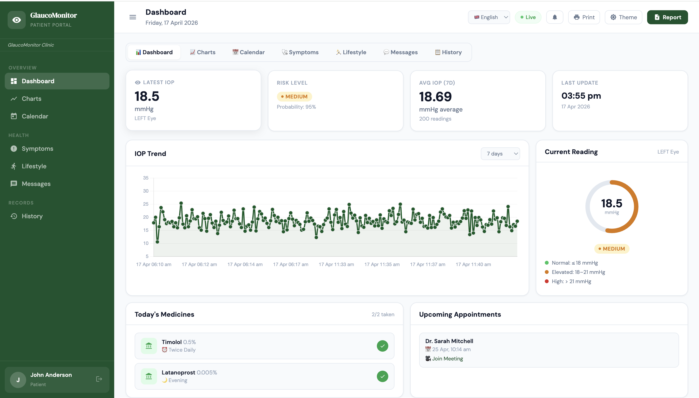
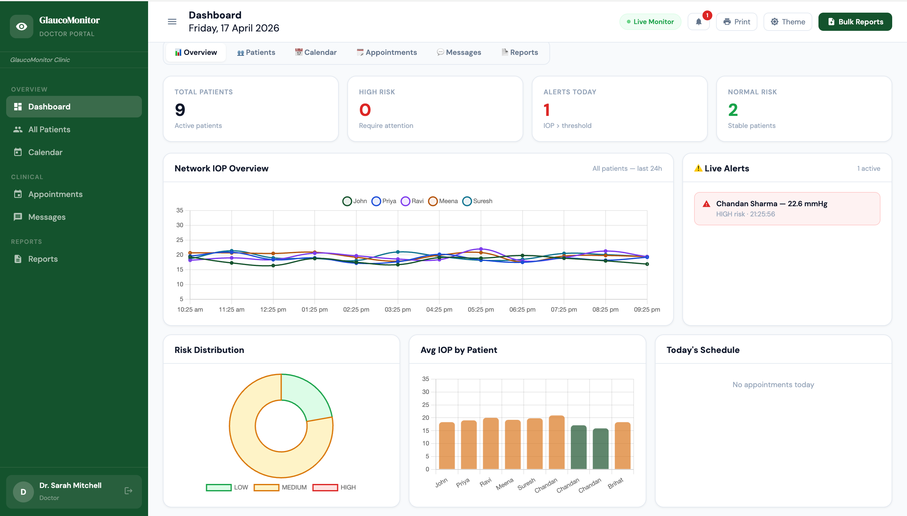
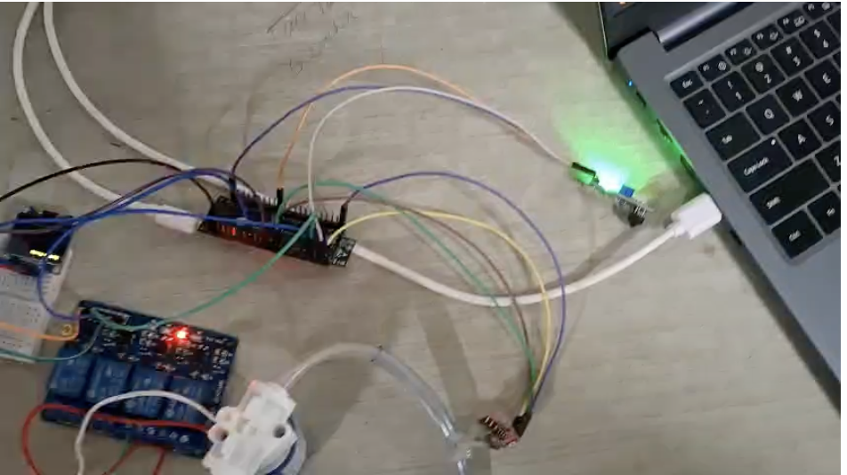
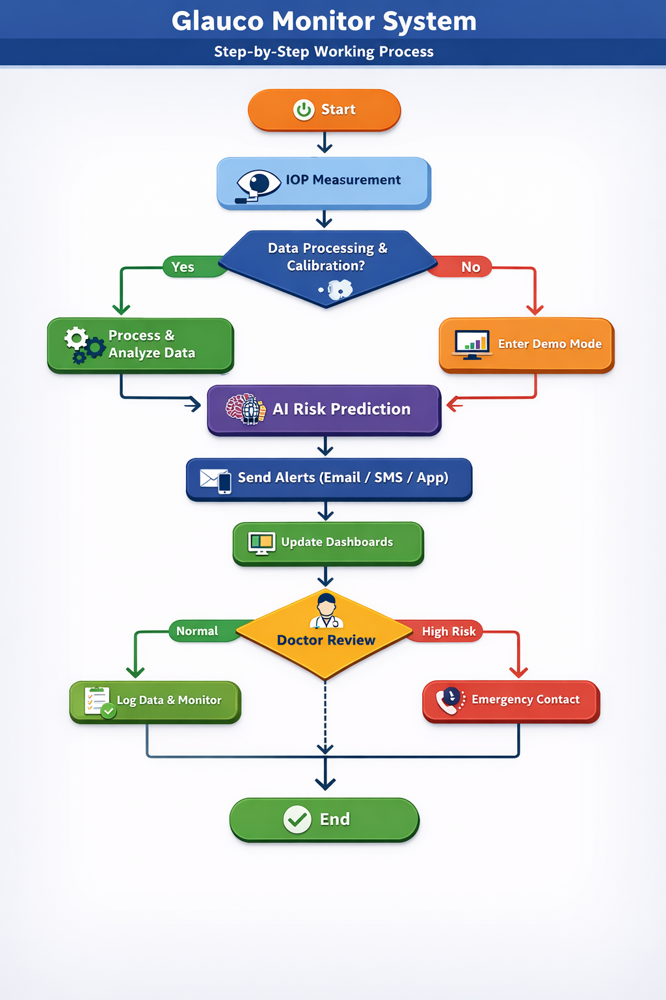

[](https://www.python.org/)
[](https://opensource.org/licenses/MIT)
[](https://www.python.org/)
[](https://scikit-learn.org/)
[](https://flask.palletsprojects.com/)

# 🔐 Glauco Monitor System

### Real-Time Intraocular Pressure Monitoring System

**AI-powered glaucoma risk prediction · Live sensor data · Doctor and Patient dashboards**

GlaucoMonitor** is a full-stack medical IoT system for real-time **Intraocular Pressure (IOP)** monitoring — the primary risk factor for glaucoma, the leading cause of irreversible blindness worldwide.

> Medical Disclaimer: This project is for research and educational purposes only. It is NOT a certified medical device and must not be used for clinical diagnosis without proper regulatory approval.

## 🎯 What Makes This Project Unique?

### Hardware and Sensing

- ESP32 + HX710B 24-bit ADC pressure sensor
- Air-puff applanation tonometry with IR detection
- OLED display for real-time feedback
- Automatic calibration on startup
- Demo mode when no hardware connected

## ⚡ Core Capabilities

### Patient Dashboard
- Real-time IOP gauge with live WebSocket updates
- IOP trend chart (24h / 7d / 30d)
- Left vs Right eye comparison chart
- Risk distribution pie chart
- Time-of-day heatmap
- Monthly IOP calendar colour-coded by risk
- Symptom logger (pain, blurriness, headache, redness)
- Lifestyle tracker (sleep, exercise, stress, water)
- Medicine tracker with daily reminders
- In-app messaging with doctor
- Dark mode, mobile responsive, Tamil/Hindi language support

### Doctor Dashboard
- All-patients overview with live IOP updates
- Patient search and filter by age, risk level, status
- Add/edit patient medications
- Schedule appointments with Google Meet links
- Clinical visit notes per patient
- Discharge patients
- Bulk PDF report download for all patients
- Live alert panel for high-IOP readings

### AI Risk Prediction
- RandomForest classifier (scikit-learn)
- Features: IOP value, patient age, corneal thickness
- Output: LOW / MEDIUM / HIGH risk + probability score
- Auto-trains on first startup, saves model as .pkl

### Alert System
- Email via Gmail SMTP
- SMS via Twilio
- WhatsApp via Twilio WhatsApp API
- Telegram Bot
- 30-minute escalation to emergency contact
- Configurable threshold via environment variable

### Security
- JWT authentication (24h expiry)
- bcrypt password hashing
- Role-based access control (Doctor / Patient)
- Environment variable secrets management

---
## System Architecture

```
Hardware Layer
  HX710B Sensor -> ESP32 -> USB Serial (115200 baud) -> Python Backend

FastAPI Backend
  Serial Reader (async) -> ML Service (RandomForest) -> MongoDB
  REST API (/auth /patients /measurements /reports /messages)
  WebSocket Server (/ws/{patient_id} and /ws/all)
  Alert Service (Email / SMS / WhatsApp / Telegram)

Frontend
  Patient Dashboard (patient.html) - 7 tabs with live charts
  Doctor Dashboard (doctor.html)   - 6 tabs with patient management
  Add Patient Page (add_patient.html)
```

---

## Project Structure

```
glaucoma_monitor/
├── backend/
│   ├── main.py                  # FastAPI app + WebSocket endpoint
│   ├── run.py                   # Server launcher with auto port selection
│   ├── requirements.txt         # Python dependencies
│   ├── Dockerfile               # Container config
│   ├── .env.example             # Environment variables template
│   ├── models/database.py       # Pydantic v2 models + DB seeding
│   ├── routers/
│   │   ├── auth.py              # Login, register, JWT
│   │   ├── patients.py          # Patient CRUD + photo + discharge
│   │   ├── measurements.py      # IOP history + manual entry
│   │   ├── messages.py          # Chat, notes, appointments, symptoms
│   │   └── reports.py           # PDF generation
│   ├── services/
│   │   ├── auth_service.py      # JWT + bcrypt
│   │   ├── serial_reader.py     # ESP32 USB serial + demo fallback
│   │   ├── ml_service.py        # RandomForest risk prediction
│   │   ├── websocket_manager.py # Real-time WebSocket broadcast
│   │   └── alert_service.py     # Email/SMS/WhatsApp/Telegram
│   └── ml/glaucoma_model.pkl    # Auto-generated (not in git)
├── frontend/
│   ├── index.html               # Login and registration
│   ├── patient.html             # Patient dashboard
│   ├── doctor.html              # Doctor dashboard
│   ├── add_patient.html         # Add new patient form
│   └── config.js                # API URL configuration
├── esp32/
│   └── glaucoma_monitor.ino    # Arduino firmware
├── docker-compose.yml
└── nginx.conf
```

---


### (DASHBOARD OF Glaucoma Monitor System for Patient)


### ((DASHBOARD OF Glaucoma Monitor System for Doctor))


### ((Demo Image ))


## 🚀 Quick Start
### Prerequisites
- Python 3.11+
- MongoDB 7.0+ (or Docker)
- Arduino IDE 2.x (for ESP32 firmware)

### 1. Clone

```bash
git clone https://github.com/YOUR_USERNAME/glaucoma-monitor.git
cd glaucoma-monitor
```

### 2. Start MongoDB

```bash
docker run -d -p 27017:27017 --name mongo mongo:7
```

### 3. Configure environment

```bash
cd backend
cp .env.example .env
# Edit .env with your values
```

### 4. Run backend

```bash
python3 -m venv venv
source venv/bin/activate
pip install -r requirements.txt
python run.py --reload
```

### 5. Serve frontend

```bash
cd frontend
python3 -m http.server 3000
```

Open **http://localhost:3000**

### Demo Accounts

| Role | Email | Password |
|------|-------|----------|
| Doctor | doctor@glaucoma.demo | doctor123 |
| Patient | patient@glaucoma.demo | patient123 |
| Patient | priya@glaucoma.demo | demo123 |
| Patient | ravi@glaucoma.demo | demo123 |

---
## Hardware Setup

### Wiring

```
ESP32 GPIO 4  ---- HX710B DOUT
ESP32 GPIO 5  ---- HX710B SCK
ESP32 GPIO 17 ---- Air Pump relay
ESP32 GPIO 13 ---- IR sensor DO
ESP32 GPIO 21 ---- OLED SDA
ESP32 GPIO 19 ---- OLED SCL
ESP32 3.3V    ---- HX710B VCC
ESP32 GND     ---- HX710B GND
```

### Flash Firmware
1. Install Arduino IDE 2.x
2. Add ESP32 board support URL in Preferences:
   `https://raw.githubusercontent.com/espressif/arduino-esp32/gh-pages/package_esp32_index.json`
3. Install "esp32 by Espressif Systems" via Boards Manager
4. Open `esp32/glaucoma_monitor.ino`
5. Select ESP32 Dev Module and your port
6. Upload

---

## Deployment

### Railway (Backend) + Vercel (Frontend)

1. Create free MongoDB Atlas cluster at cloud.mongodb.com
2. Push this repo to GitHub
3. Connect to Railway → deploy `backend/` folder → add environment variables
4. Edit `frontend/config.js` with your Railway URL
5. Connect to Vercel → deploy `frontend/` folder

### Docker (Self-hosted)

```bash
cp backend/.env.example .env
docker-compose up -d
```

---
## API Reference

Full interactive docs: `http://localhost:8000/docs`

| Endpoint | Method | Auth | Description |
|----------|--------|------|-------------|
| /api/auth/login | POST | — | Get JWT token |
| /api/auth/register | POST | — | Create account |
| /api/patients/ | GET | Doctor | List all patients |
| /api/measurements/history | GET | JWT | IOP history |
| /api/reports/download/:id | GET | JWT | Download PDF |
| /ws/:patient_id | WS | JWT | Live IOP stream |

---


## AI Model

| Feature | Range | Notes |
|---------|-------|-------|
| IOP (mmHg) | 8–35 | Primary risk factor |
| Age (years) | 20–90 | Higher risk after 60 |
| Cornea thickness (μm) | 440–640 | Thin = underestimated IOP |

Risk levels: LOW (IOP ≤ 18), MEDIUM (18–24), HIGH (> 24)

---

## Security Checklist

- [ ] Change `JWT_SECRET_KEY` to random 32-char string
- [ ] Restrict MongoDB Atlas IP whitelist
- [ ] Use Gmail App Password not account password
- [ ] Set `SERIAL_PORT=DISABLED` on cloud servers
- [ ] Enable HTTPS (automatic on Railway/Vercel)

---

## Built With

FastAPI · MongoDB · scikit-learn · ReportLab · Chart.js · pyserial-asyncio · Twilio · Arduino ESP32 · HX710B

---

## License

MIT License — see [LICENSE](LICENSE) for details.

---

## Medical Disclaimer

This software is for research and educational purposes only. It is NOT a certified medical device. Always consult a qualified ophthalmologist for glaucoma diagnosis and management.

Normal IOP range: 10–21 mmHg.

## 📊 System Architecture Overview



### 📊 Working Demo Video 

[▶️ Watch Full Demo](https://raw.githubusercontent.com/Chandan-coder07/Glaucoma-Monitoring-System/main/assets/demo.mp4)

## 👨‍💻 Author

**Chandan Kumar Sharma **  
*Department of Computer Science and Engineering*  
**KPR Institute of Engineering and Technology (KPR IET)**  
*Coimbatore, Tamil Nadu, India*

**© 2026 Chandan Kumar Sharma | KPR Institute of Engineering and Technology, CSE Department**

*Built with ❤️ for a safer digital world* 🔐